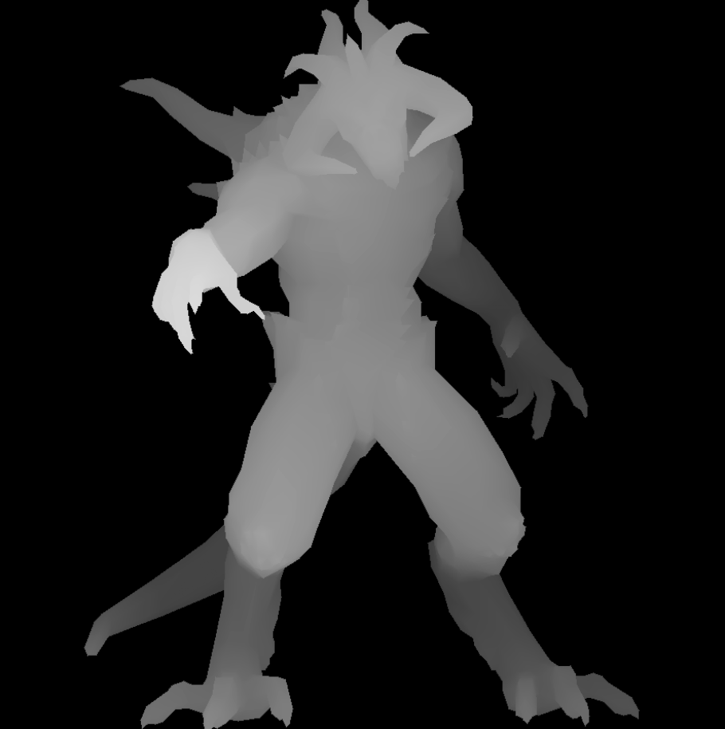
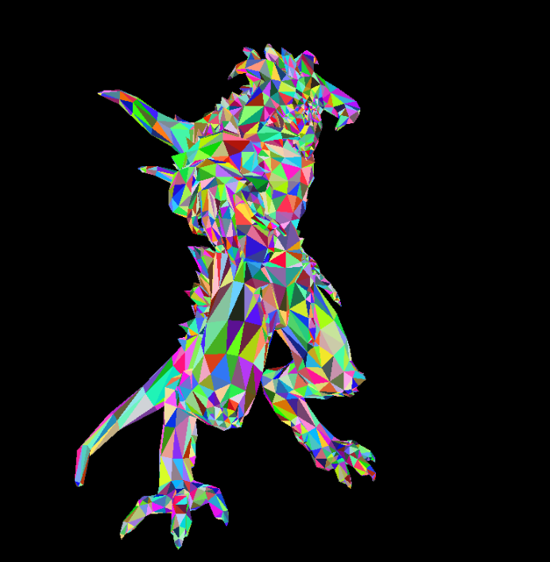
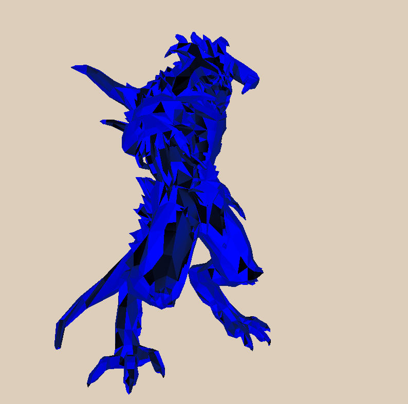
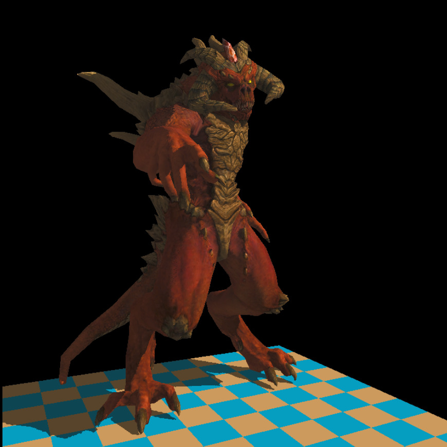

# myOwnTinyRenderer   
The code of [tinyrenderer](https://haqr.eu/tinyrenderer/) for learning low-level grahpics.   
<figure>
    
    <figcaption>Result: This image visualizes Z-values of freagments.</figcaption>
    
    <figcaption>Result: The rotated object by linear transform.</figcaption>
    
    <figcaption>Result: The phong shaded image.</figcaption>
    
    <figcaption>Result: perspective-corrected-and-shadow-mapping</figcaption>

</figure>
